# 软件需求规格说明书

{:.no_toc}

* 目录
{:toc}

## 1. 引言

### 1.1 编写目的

为明确项目需求、规划项目、确认进度、组织项目开发并测试而撰写本文档。同时，本文档详细分析项目总体需求，阐述项目背景及范围等总体结构和功能结构，便于项目团队成员更好地了解项目情况，也便于用户与开发成员进行沟通交流。

### 1.2 背景

互联网时代的众包，是依靠网络平台发挥用户隐性知识资源和多样性资源来创造价值。然而，国内高校的知识、人力、物资等资源的利用率和有效率被低估，高校大学生对众包的需求也被低估，导致面向大学生的众包系统严重缺乏。我们的挣闲钱系统就是以微信小程序为载体，面向大学生的众包系统。

### 1.3 定义

### 1.4 参考资料

> [1] GB856T--88，软件设计文档国家标准—软件需求说明书

## 2. 任务概述

### 2.1 目标

开发基于微信小程序的应用程序，打造一款广泛推广的手机挣闲钱小程序，并提供管理系统，实现安全可靠的大学生专业“众包”平台。

### 2.2 功能需求

#### 2.2.1 用例图

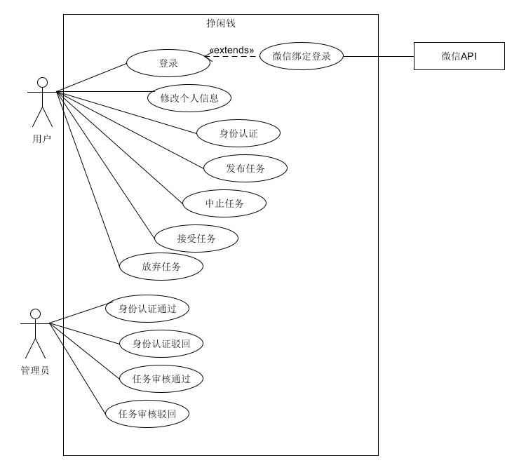

#### 2.2.2 活动图

1. 用户授权登录及身份认证

用户授权成功后自动登录获取信息，进入身份认证页面提交身份认证信息，认证成功后身份绑定。

用户身份认证信息有误，被管理系统驳回并需要重新认证。

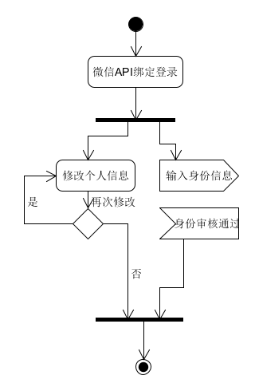

2. 发布、接受、放弃、中止、完成任务

    * 用户提交任务信息发布任务，在管理系统审核通过下即可发布；
    * 在任务发布后，发布者可以中途中止任务；
    * 符合条件的用户可以接受任务；
    * 接受任务后用户可以中途放弃任务（超过时限没有完成任务也算放弃任务）；
    * 用户完成任务提交证明，获得赏金。

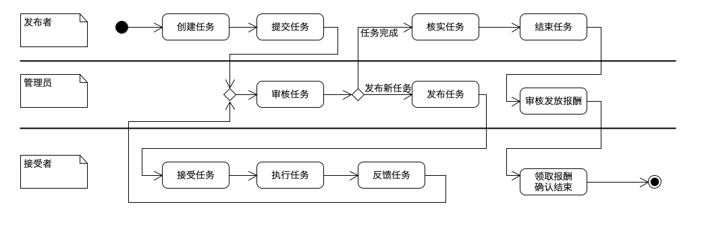

#### 2.2.3 领域模型

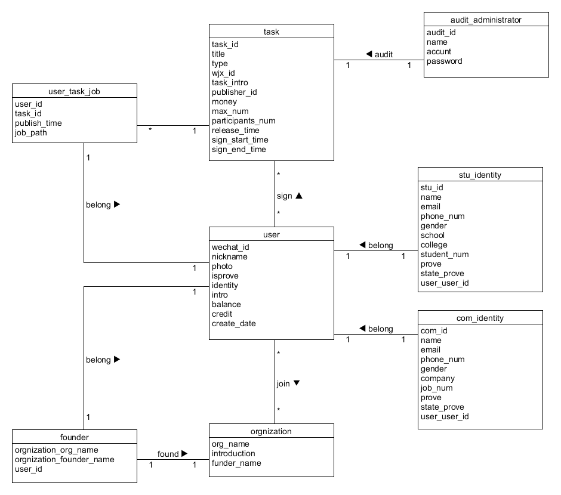

#### 2.2.4 状态模型

1. 身份认证状态模型

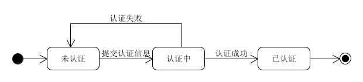

2. 任务状态模型

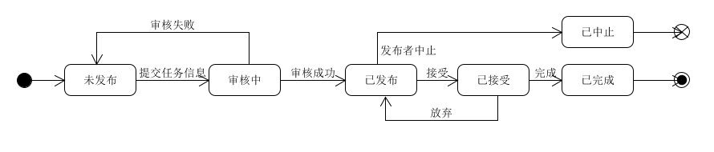

#### 2.2.5 功能模型

1. 用户认证

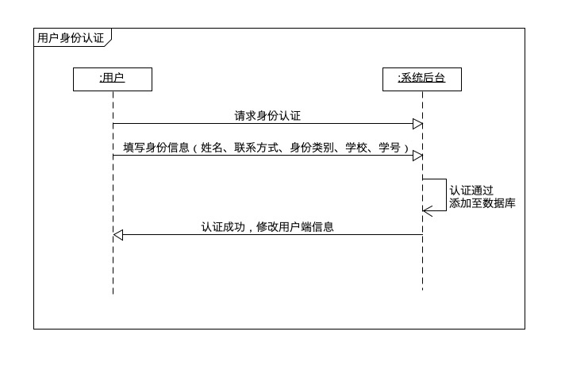

2. 用户发布任务

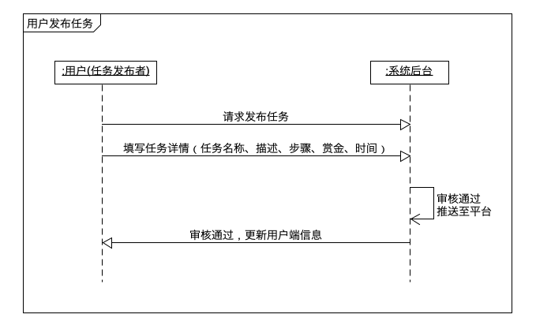

3. 用户接受任务

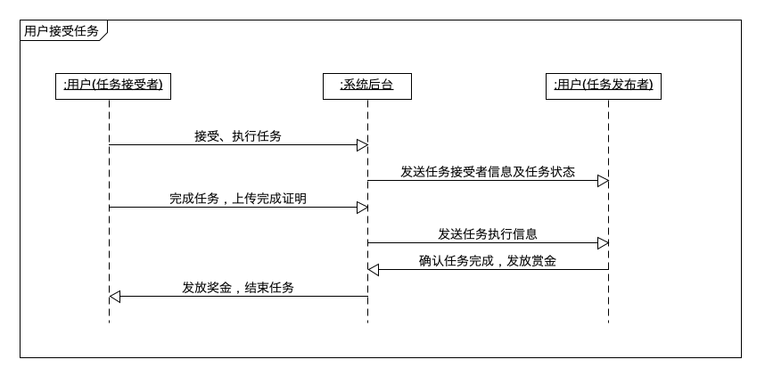

4. 任务发布者中止任务

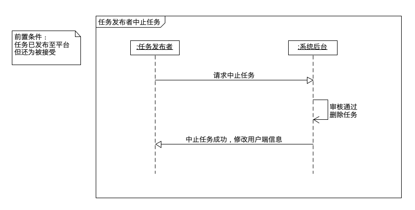
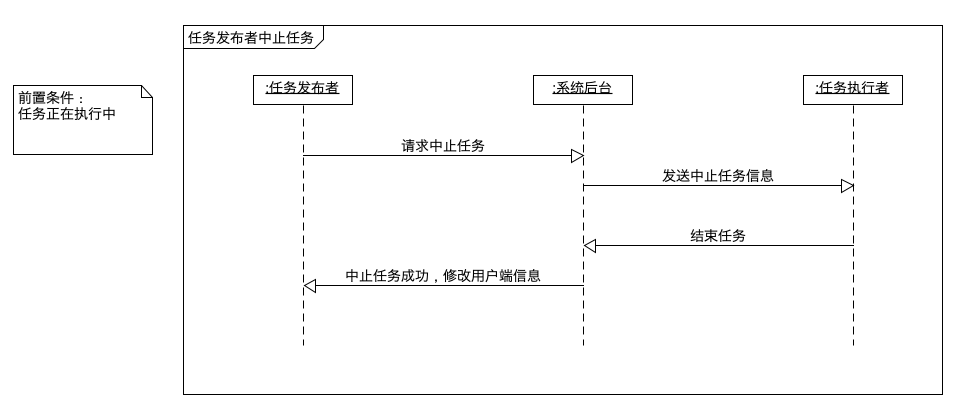

5. 任务接受者放弃任务

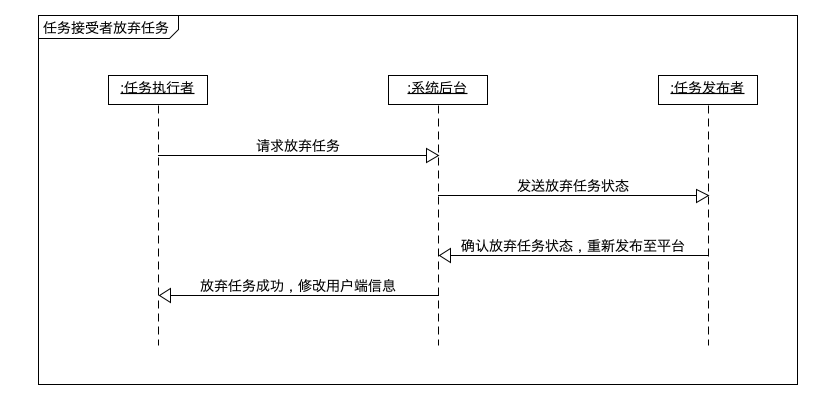

6. 任务发布者添加任务信息

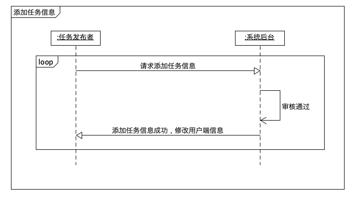

### 2.3 用户特点

1. 挣闲钱用户系统的最终用户为熟悉微信客户端及微信小程序操作的用户，主要面对高校大学生，其次还有外部机构的企业人员（“奶牛”）作为任务的主要提供者
2. 挣闲钱用户具有较为灵活的碎片时间，有能力利用这些碎片时间在平台进行“兼职”活动
3. 挣闲钱用户具有别人帮助其完成任务的需求，并愿意支付一定的金钱作为奖励
4. 管理系统的最终用户为整个系统的管理人员，如运营团队。

### 2.4 假定与约束

进行本系统开发的约束条件如下:

* 时间约束：本系统开发周期为3个月，产品经理需要合理规划时间，前后端开发人员需要跟上布置的任务。

* 实现约束：
    * 用户端：使用微信小程序，一种基于微信的服务形式，更加接近原生态，并且无需安装，提高用户体验。小程序开发使用WePY框架，能够组件化、单文件开发。
    * 管理员端：选择使用Web端，商家对产品的功能完整性有较高的需求；基于开发难度和社区活力的考虑，Web框架使用Vue进行SPA应用开发。

* 法律约束：

    - 用户（任务发布者）在平台发布的任何任务信息必须属实，并对于用户提出的有权知悉的情况的问题，应予以告知，不可以隐瞒欺骗，本平台要求平台用户上传个人证明也是为了保护消费者的知悉真实情况权益

      > 消费者拥有“知悉真实情况权”
      >
      > 即消费者所享有的知悉其购买、使用的商品的过程中或者接受的服务的真实情况的权利。消费者有权知悉的情况具体包括商品的价格、产地、生产者、用途、性能、规格、等级、主要成份、生产日期、有效期限、检验合格证明、使用方法说明书、售后服务，或者服务的内容、规格、费用等等。
      >
      > *选自《中华人民共和国消费者权益保护法》*

    - 用户（任务接受者）在我们的点餐平台上可以自主选择，不会给任务发布者有强制推荐的漏洞，让任何一方用户放心

      > 消费者拥有“自主选择权”
      > 即消费者自主选择商品或者服务的权利。包括两方面：一是对商品的品种、服务方式及其提供者应有充分选择的余地;二是对于选择商品服务及其提供者应有自由决定的权利而不受强制。实际生活中，损害消费者自由选择权的现象主要是“官商”习气、商品搭售和强买强卖等。
      > *选自《中华人民共和国消费者权益保护法》*

    - 本平台保证在涉及奖金发布方面不会出现计量失误；用户在符合要求的情况下，可以申请中止或放弃任务，对于未完成的任务，用户（任务发布者）已支付的金钱回原途径返回。对于完成的任务交易详情，本平台会予以详细准确永久性的记录

      > 消费者拥有“公平交易权”。
      > 是指消费者在购买商品或者接受服务时，有权获得质量保障、价格公平合理、计量准确无误等公平交易条件，有权拒绝经营者的强制交易。
      > A. 关于商品和服务的质量，消费者有权要求其符合国家规定的标准或者与生产经营者约定的标准，不致因质量低劣而妨碍消费。如果经营者提供的商品或者服务不符合规定的质量要求，消费者有权要求修理、更换、退货、降价等。
      > B. 关于商品和服务的价格，消费者有权要求生产经营者执行国家的价格政策、法规或按质论价，商品价格或服务费用合理，不因乱涨价或乱收费而受到经济利益损失。
      > C. 关于商品和服务的计量，消费者有权要求生产经营者计量准确、足量，不致因短尺少秤而遭受经济利益损害。生产经营者更应自觉守法，遵守职业道德，不在计量上弄虚作假。对于工厂包装的产品，消费者有权要求其注明净重量或容量，并与实际相符;交易时计量的商品，消费者有权查明度量、衡器是否准确，有权看秤、复秤，对不足分量者有权要求退货或退回多收的价款
      > *选自《中华人民共和国消费者权益保护法》*

    - 本平台保证尊重并保护每一位用户在使用本平台时上传的用户个人信息及个人隐私；用户主动注销账号时，我们将根据相关法律法规要求尽快删除用户的个人信息

      > 电子商务经营者应当明示用户信息查询、更正、删除以及用户注销的方式、程序，不得对用户信息查询、更正、删除以及用户注销设置不合理条件。
      >
      > 电子商务经营者收到用户信息查询或者更正、删除的申请的，应当在核实身份后及时提供查询或者更正、删除用户信息。用户注销的，电子商务经营者应当立即删除该用户的信息；依照法律、行政法规的规定或者双方约定保存的，依照其规定。
      >
      > *选自《中华人民共和国电子商务法》*

    - 本平台会对用户发布的任务内容进行审查，防止不合国家法律规定等内容在平台的出现，以保证营造一个合法、健康、有序的平台

## 3. 需求规定

### 3.1 对功能的规定

* 用户必须在授权登录并实名认证通过后才能进行其他操作，如任务的发布、接受等；
* 用户可以发布任务，目前可以发布调查问卷、普通任务，在填完任务信息并确认无误后提交；
* 提交任务后，支付需要的赏金，之后再管理端通过后便可发布；
* 用户可以浏览推荐任务列表，全部任务列表；
* 用户点击任务可以浏览任务详情，根据需求接受任务，接受任务后可以根据实际情况线上或线下完成任务；
* 用户完成任务后，提交对应的证明，确认后即可获得赏金；
* 用户在发布任务后可以中止任务，接受任务后可以放弃任务，但会受到一定的惩罚。
* 管理员登录管理系统，对用户的身份信息和任务信息的真实程度进行审核。

### 3.2 对性能的规定

本系统的主要应用为微信小程序，需要有较快的加载速度和页面渲染速度，所以页面上的逻辑处理不应该过于复杂，计算的内容不宜过度，以免造成界面卡顿。

#### 3.2.1 精度

赏金的精度为小数点后两位，如1.50，0.50等。

#### 3.2.2 时间特性要求

1. 响应时间：任务列表的获取时间在3秒内，但任务的发布、接受、中止、放弃等的响应时间应该在1秒内；
2. 数据的转换和传送时间：数据的转换需在2秒内，传送时间需在1秒内。

#### 3.2.3 灵活性

1. 用户只能在微信小程序上进行任务的发布与接受，管理员可以在浏览器上进行信息的管理审核。
2. 本项目可以在IOS和安卓各大系统上运行，并能适应屏幕尺寸的变化。

### 3.3 输入输出要求

* 输入数据类型：浮点型、字符串型、多媒体型；
* 输出数据：浮点型、字符串型；

### 3.4 数据管理能力要求

### 3.5 故障处理要求

### 3.6 其他专门要求

#### 3.6.1 可维护性

* 修改某个模块时，对其他模块的影响和修改代价经可能校（改动不超过5%）

#### 3.6.2 可扩展性

* 允许更多的功能在必要时可以被插入到适当的位置中。

#### 3.6.3 易读性

* 代码需要有较强的可读性，模块划分清晰，功能明确；
* 需要有合理的注释和软件开发文档说明。

#### 3.6.4 可用性

* 操作方便，不需要太多学习成本，甚至不需要阅读用户手册，操作流程合理；
* 具备容错能力，能拒绝用户的某些不合理的操作，比如不合法的输入。

#### 3.6.5 可靠性

* 系统能够在规定的条件下和规定的时间区间完成规定功能。

#### 3.6.6 安全性

* 用户必须需要实名认证并通过后才能进行任务的方便与接受，管理员需要使用账号和密码登录管理系统。

## 4. 运行环境规定

### 4.1 设备

* 挣闲钱用户系统需要运行在智能触屏手机，管理系统需要运行在支持浏览器的操作系统上。

### 4.2 支持软件

* 挣闲钱用户系统需要运行在微信小程序上，管理系统需要运行支持vue1的浏览器上，例如Firefox4.0+、Chrome 5+、IE 9+

### 4.3 接口

### 4.4 控制
